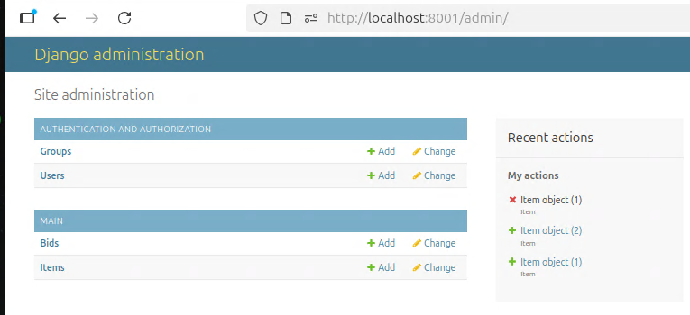
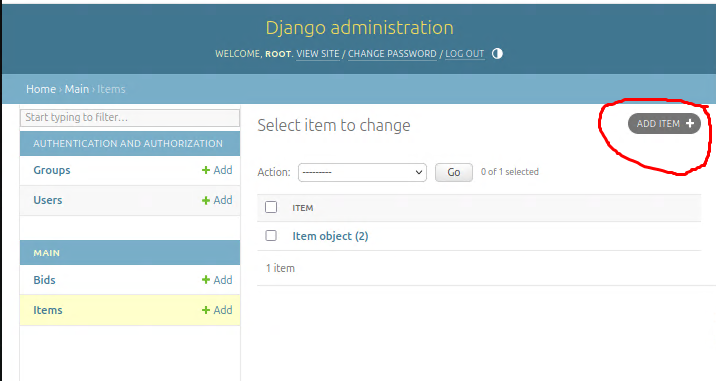

# everything-must-go

This is a Django web app for auctioning off items to the highest bidder. It's useful if you're moving and you need to get rid of stuff.

There's no mechanism for payment processing - the app merely notes how much each bidder is supposed to pay. So, you should only use it among people you trust to pay their debts.


## Project Base:

Framework : Django 4.2

Database : SQLite


### Installation

Follow these steps to set up and run the Django Poll Application:

1. Clone the repository to your local machine:

   ```bash
   git clone https://github.com/GGurol/everything-must-go.git
   ```

2. Navigate to the project directory:

   ```bash
   cd everything-must-go
   ```

3. Build the docker and build:

   ```bash
   docker compose up --build -d
   ```

4. Apply database migrations:

   ```bash
   docker compose exec web python manage.py makemigrations
   docker compose exec web python manage.py migrate
   ```

5. Create a superuser to access the admin interface:

   ```bash
   docker compose exec web python manage.py createsuperuser
   ```


6. Now login into admin panel, : http://localhost:8001/admin



Add Items for bidlist:


(Screenshot_3.png)


### Running the app

This is standard Django stuff:

Initialize the database with `python manage.py migrate`. Create an admin account with `python manage.py createsuperuser`.

To run locally for development, do `python manage.py runserver` and open http://127.0.0.1 in a browser.

There's not much I can say about how to run it in production, since each host will have a different procedure for deploying Django apps.

## Using the site

### Adding items

There's no real interface for adding items for sale. To do this, first log in using the credentials you created in the `createsuperuser` step, and then go to the URL `/admin`. Next to "Items", click "Add". Fill in the fields, and then save the item.

"Image url" should point to an image of the item. (There's no facility for uploading images, so you should host them on a site like [Imgur](http://imgur.com).) "Ask" is the minimum bid allowed, which must be a multiple of $0.25. "Category" should be exactly one of: `books clothing toys office household food`. (If you want to change the list of categories, you'll need to edit the template at `templates/main/index.html`.)

### Running the auctions

There's no email required to sign up, so you should ask people who sign up to tell you their username by some means (email, in person, etc.), so that you can contact them if they win stuff.

Bids must be in multiples of $0.25. The price listed on top of the image is the price that new bidders have to beat, and the price that the winner would pay if bidding were to close right now. If two bids are tied for highest, then the earliest one wins.

It's important that bidders understand: If there are two or more bids, the listed price is just $0.25 plus the second-highest bid. **This means that you don't need to constantly one-up the last bid by $0.25 whenever a bid is made until you're unwilling to bid further.** Instead, you should just bid the most you're willing to pay. The result will be the same as if you had employed this strategy.

Of course, this means that you, the admin, have a responsibility to keep the actual bids secret, and to refrain from participating yourself. (The bids are listed in a table on each item's page, but only when you're logged in as the superuser.) Otherwise, people will lose trust in the system, and revert to the "increment by $0.25" strategy, and it'll generally be annoying for everyone.
